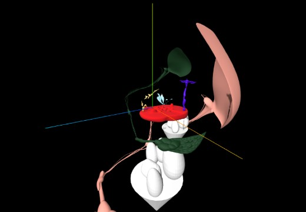

## WHERE ALL STARTED 🐖

#### Before i started with the react version, i practiced with a vanilla Flag version of the image below:

[vanilla flag version](https://github.com/nadiamariduena/3d-waving-flag-threejs)

- REACT THREE version

 
 

 
 

## BASIC RESPONSIVE SCENE

- In the following project you will learn how to create a responsive scene (zoom in and zoom out )

 
 

 
 

# Lights 0

- In the following repo you will learn how to create a basic light set up (responsive)

 
 

 
 

# Lights 01

 

- PointLight
- Directional Light
- AmbientLight
- HemisphereLight

 
 

 
 

# Importing Models

#### Models made with Blender (part 1)

 

- Creating Models with Blender
- Adding Textures in Blender
- Exporting the model from Blender to Three-js
- Adding the Model to the scene with (GLTFLoader)

 

###### In this project I had to learn how to use the basics of Blender in a couple of hours (not so difficult since i already have a bit of experience with 3ds max)

 
 

 
 

# Models made with Blender (part 2)

- creating models (learning how to) in Blender

- Warning about the uses of different types of lights

- Whats is (DELTA) for animations

- Tips about creating a VIDEO GAMES (tutorials, articles etc)

- WebGL With Three.js: Textures & Particles

 

 
 

 
 

# Models made with Blender (part 3)

- Understanding the Exporter Settings

- SCALING WHEN EXPORTING

- what is quaternions?

- Tweening… what’s that?

- what is AXIS HELPER and GRID HELPER ?

- Compressing 3D Model Files with Draco (links)

- Optimizing 3D data with Draco Geometry Compression (links)

- Installing CMake (links)

 

  
