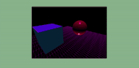

# BASIC CUBE and FLAG (responsive)

- In the following repo you will learn how to create a responsive scene (zoom in and zoom out )

 
 

 
 

# Lights 0

- In the following repo you will learn how to create a basic light set up (responsive)

 
 

 
 

# Lights 01

 

- PointLight
- Directional Light
- AmbientLight
- HemisphereLight 