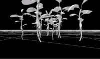
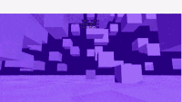
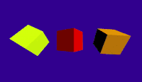
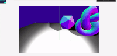
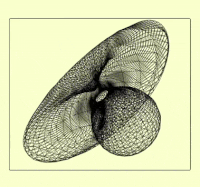
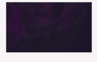
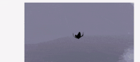

### THREEJS
### Blender and Threejs

  
 
 

# INTERMEDIARY

### FIRST PERSON CONTROLS

- Code and commun issues:

[ First Person Controls](https://github.com/nadiamariduena/firstpersoncontrol-threejs)

 

- Click on the image to test it:

  
 
 

### POINTER LOCK CONTROLS

- Code and commun issues:

[POINTER LOCK CONTROLS](https://github.com/nadiamariduena/nm-pointer-lock-control-purplerain)

 

- Click on the image to try it:

 
 
 

### DRAG CONTROLS

- Code and commun issues:

[DRAG CONTROLS](https://github.com/nadiamariduena/nm-drag-controls-purplerain)

 

- Click on the image to try it:

  
 
 
 
   

### PHYSICS with CANNON (part 1)

- Code and commun issues:

[PHYSICS with Cannon 1](https://github.com/nadiamariduena/nm-physics-cannonjs)

- Click on the image to try it:

 
 
 

### Animating with Perlin

- Code and commun issues:

[DRAG CONTROLS](https://github.com/nadiamariduena/nm-drag-controls-purplerain)

 

- Click on the image to try it:

 
 
 

# COMPRESSING

- Compressing with draco

- Draco and cmake

- cmake installation

- glTF Pipeline compression

 

[DRACO | CMAKE Compression](https://github.com/nadiamariduena/nm-final-three-scene)

 
 

### Importing DRACO to the scene "solved" 🐖

- Compressing with draco and cmake and Blender

- Importing Draco to the scene "solved"

- GUI panel example

 

[Importing Draco to the scene](https://github.com/nadiamariduena/blender_and_draco-compression)

  
 

 
   

### Rain and Fog ....

- Setting up a basic scene

- **Cameras** here are set up differently because we have **to look up to the sky**

- Also I had to **Hide** the **{ OrbitControls }** as it clashes with the scene in this project

- If you use the { OrbitControls } you will see the image squared shape (I still have to figure out how to prevent that), but if you remove the Orbits.. you wont see that

[PURPLE RAIN , Cloud and Fog](https://github.com/nadiamariduena/nm-rain1-draco-compress)

 

##### Click on the image to go to the Repo:

 
 
 

### Purple Rain

- I added the rain , the clouds and the flashlight to the scene
   

- I also added a CUBE to simulate a world
   

- I added 6 images to each side of the cube to simulate it
   

- I added a zoom limitation , so that the user cant zoom out after the specified limits

##### But since i didnt like it i will remove it in the next test

 

  
 
 
 
   

# BEGINNER

### BASIC RESPONSIVE SCENE

- In the following project you will learn how to create a responsive scene (zoom in and zoom out )

 
 

 
 

### Lights 0

- In the following repo you will learn how to create a basic light set up (responsive)

  
 
 

### Lights 01

 

- PointLight
- Directional Light
- AmbientLight
- HemisphereLight

 
 
 

### Importing Models

#### Models made with Blender (part 1)

 

- Creating Models with Blender
- Adding Textures in Blender
- Exporting the model from Blender to Three-js
- Adding the Model to the scene with (GLTFLoader)

 

###### In this project I had to learn how to use the basics of Blender in a couple of hours (not so difficult since i already have a bit of experience with 3ds max)

 
  
 

### Models made with Blender (part 2)

- creating models (learning how to) in Blender

- Warning about the uses of different types of lights

- Whats is (DELTA) for animations

- Tips about creating a VIDEO GAMES (tutorials, articles etc)

- WebGL With Three.js: Textures & Particles

 
  
 

### Models made with Blender (part 3)

- Understanding the Exporter Settings

- SCALING WHEN EXPORTING

- what is quaternions?

- Tweening… what’s that?

- what is AXIS HELPER and GRID HELPER ?

- Compressing 3D Model Files with Draco (links)

- Optimizing 3D data with Draco Geometry Compression (links)

- Installing CMake (links)

 

 
 
 

### FLAG SCENE

- Using Math.sin to animate the vertices

 

### UDEMY three

##### THREE.js and Typescript

[THREE.js and Typescript ](https://github.com/nadiamariduena/udemy-threejs-typescript)

<!-- Preview

- Setup Development Environment

- Install TypeScript

- Build Your First TypeScript File

- Type Annotations

- Interfaces and Type Declarations

- Classes

- Run it in the Browser

- Begin Creating the Three.js Project

- Add the Initial Scripts

- Server Side Dependency Imports

- Client Side Dependency Imports

- Importing Three.js Modules

- Automate Compilation with TSC Watch, Nodemon and Concurrently

- Install the Three.js Typescript Boilerplate

- Scene, Camera and Renderer

- Animation Loop

- Stats Panel

- Dat GUI Panel

- Module Specifiers Versus Relative Import References

- Object3D

- Geometries

- Material

- MeshBasicMaterial

- MeshNormalMaterial

- MeshLambertMaterial

- MeshPhongMaterial

- MeshStandardMaterial

- MeshPhysicalMaterial

- MeshMatcapMaterial

- MeshToonMaterial

- Specular Map

- Roughness and Metalness Maps

- Bump Map

- Preview

- Preview

- Texture Mipmaps

- Custom Mipmaps

- Anistropic Filtering

- Lights

- Ambient Light

- Directional Light

- Hemisphere Light

- Point Light

- Preview

- Spot Light Shadow

- Directional Light Shadow

- Orbit Controls

- Trackball Controls

- Pointerlock Controls

- Drag Controls

- Transform Controls

- Using Multiple Controls in the Same Scene

- OBJ Model Loader

- MTL Loader

- GLTF Loader

- DRACO Loader

- FBX Loader

- FBX Animations

- GLTF Animations

- Custom GLTF Animations

- Raycaster

- Using tween.js

- Using tween.js and the THREE. AnimationMixer

- Physics with Cannon.js

- The Cannon.js Debug Renderer

- ConvexPolyhedrons and Compound Shapes

- Deploying to Production

- Create the Start Script

- Provision a Cloud Server for Production

- Deploy Files to the Server

- Start the Games on the server

- Install Nginx Proxy

- Point a Domain Name

- Add SSL

Converting JavaScript Threejs Examples to TypeScript Projects -->

 
 
 
