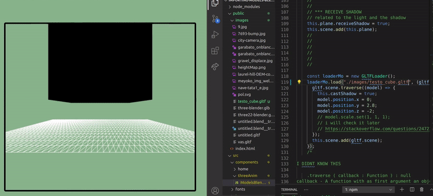
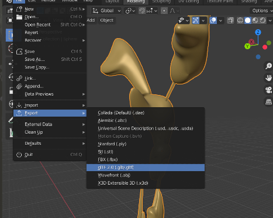
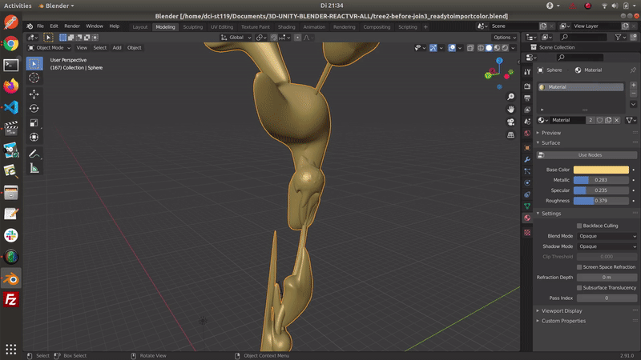
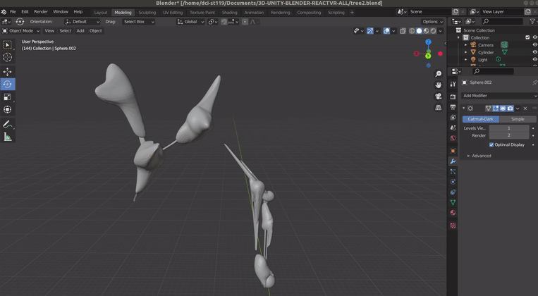
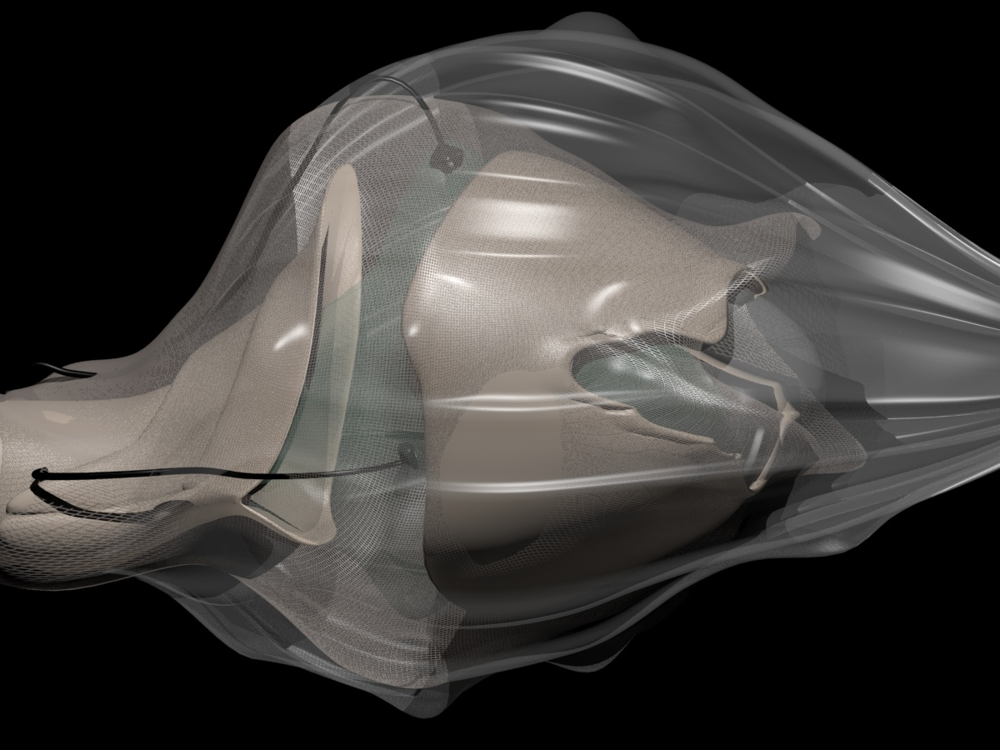

# IMPORTING BLENDER MODELS TO THREEjs

 <br>

## FIRSTLY 🍨

- I WAS SCARED OF THIS DAY... ok just a little but it finally happened :)

##### LAST TIME I DESIGNED SOMETHING IN 3D with a software such as (3ds max) was 5 years ago, So I was a bit worried about how long would it take me to design something for my final (school) project.

<br>

- It took me few hours to design something and nearly the whole day to try to apply it to the react project, but at the end I was lucky to find "life saving " tutorials" that could give me an idea of how to make it work, because unfortunately most of the articles are outdated.
  <br>

[Loading Models (using Three.js) - Both Static and Animated!](https://youtu.be/8n_v1aJmLmc)

[Create 3D Blender model and import to Three.js](https://www.youtube.com/watch?v=ZUviQP1L9uw&list=LL&index=2)

<br>
<br>
<hr>

<br>
<br>

## THE BLENDER MODEL 🌵

- I HAD THE CHOICE of using a 3d generator but I really felt like challenging myself today, **after ALL there s nothing else you can do in CORONA times**.

###### THE DESIGN was nothing complicated, what was complicated was to find a way make it, most of the trouble I had was related to ( learning the software commands), since I have never designed anything with Blender.

<br>

[]()

<br>

- One of the inconveniences I could encounter when applying the model to the app, was what the **positioning and the scaling**,
  since I am still confused about how to group the objects in Blender, its a bit messy when importing it to the project, thats why the obj's are everywhere, also due to the **group/merging** of the objects, **a part of the tree** is missing.

  <br>

  ##### Apparently there s a way to scale the model before exporting it (from BLENDER) but I am curious about the scaling in threejs, so i will figure it out later.

  <br>

[]()

<br>
<br>
<hr>
<br>
<br>

# 🍨

# HOW TO EXPORT A MODEL from BLENDER

#### _ISSUES WHEN EXPORTING THE MODEL_

<br>

- I was having some **issues when exporting the model from Blender to Threejs**, and due to that I could just see a **black Model** like in the example below:

[]()

<br>

#### In the following articles I discovered that you shouldn't ignore the "UV textures" when exporting the model:

[]()

[]()

- Click on the image to read the article

[Blender Not Exporting Textures for THREE.js](https://iwearshorts.com/blog/blender-not-exporting-textures-for-three-js/)

<br>
<br>

#### I had the wrong lights and I wasn't exporting it correctly

- Click on the image to read the article

[Ambient Light and GLTF models not working - Results in black model](https://discourse.threejs.org/t/ambient-light-and-gltf-models-not-working-results-in-black-model/7428/4)

[Glb model is very dark](https://discourse.threejs.org/t/solved-glb-model-is-very-dark/6258)

[]()
<br>

##### The answer that helped me to correct the issue of the textures

```javascript
// Because the viewer applies and environment map to the asset.

Anyway, try to traverse through gltf.scene and set metalness to 0 for a quick test.

gltf.scene.traverse( child => {

    if ( child.material ) child.material.metalness = 0;

} );
// Applying an environment map is even better to get the best visual result from MeshStandardMaterial.
```

<br>

#### The CODE before and after the material changes

```javascript
//
//                       ****          BEFORE          ****
    const loaderMo = new GLTFLoader();
    loaderMo.load("./images/testo_cube.gltf", (gltf) => {
      gltf.scene.traverse((model) => {
        model.castShadow = true;
        model.position.x = 0;
        model.position.y = 0;
        model.position.z = 0;
      });

      this.scene.add(gltf.scene);
    });
  };

//
//                       ****          AFTER          ****
//
    const loaderMo = new GLTFLoader();
    loaderMo.load("./images/tree2-before-join.gltf", (gltf) => {
      gltf.scene.traverse((model) => {
        //
        //
       // without the 'if' statement, you would not be able to see the result
        // As it helps to change the shade on the imported model
        // But it wont work if you didn't export it correctly from Blender
        if (model.material) model.material.metalness = 0.08;
       // 0.01; lighter, 1  dark, 5 extremely dark
        //
        model.castShadow = true;
        model.position.x = -2;
        model.position.y = 1.7;
        model.position.z = 1.2;
      });

      this.scene.add(gltf.scene);
    });
```

<br>

# 🍦

## BUT WHAT EXACTLY IS "traverse" ?

- It is basically the iterator through your loaded object. **You can pass the function to the traverse() function which will be called for every child of the object being traversed.** If you call traverse() on scene. you traverse through the complete scene graph.

<br>

#### Commun questions and answers about "traverse" ⛸️

```javascript
//
So, the way I get this is: the function written inside traverse argument will be
applied to all the children of our object. Right? Now, just in order to make it
clearer for myself, if we don't wanna use traverse feature, should we apply our
function (the one written in traverse arguments) for each objects of the scene
and merge all the results? – mfaieghi Aug 8 '15 at 23:19 2

//
Will object.traverse
be called on child of child? If not, what is the difference between calling
object.traverse and object.child.forEach, or for loop? – Halt Jun 29 '17 at 3:15
1
//
@Halt Yes, object.traverse will be called on children of each child. Basically
it traverses all the descendants of a any given three js object in Depth First
Traversal manner. – Hari krishna Oct 5 '17 at 18:51
//
//
https://stackoverflow.com/questions/31899398/what-does-object-traverse-mean-in-three-js#:~:text=It%20is%20basically%20the%20iterator,through%20the%20complete%20scene%20graph.
//
//
//
// Add children to a group break traverse method
https://discourse.threejs.org/t/add-children-to-a-group-break-traverse-method/12642
```

<br>
<br>

# 🍦🍦🍦

## SCALING

- You can scale it in Blnder and also threejs but I noticed that even if i scaled the model in blender "to less say" the smallest size, it will not really matter in Threejs as it will continue to be exported in a considerable size.

```javascript
    // couche one
    loaderMo.load("./images/tree2-before-join3.gltf", (gltf) => {
      gltf.scene.traverse((model) => {
        //
        // without the 'if' statement, you would not be able to see the result
        // As it helps to change the shade on the imported model
        // But it wont work if you didn't export it correctly from Blender
        if (model.material) model.material.metalness = 0.03;
        // 0.01; lighter, 1  dark, 5 extremely dark
        //
        model.castShadow = true;
        model.rotation.x = -10;
        // ----------------------
        //                set(x,y,z)
        model.scale.set(0.4, 0.4, 0.4);
        model.position.x = -1.5;
        model.position.y = 2.3;
        model.position.z = -4.2;
        // ----------------------

      });
```

<br>
<br>

## :ice_cream: LIGHTS :ice_cream:

- I had to remove 2 lights so to see the models better

- I also added a second model to the scene

<br>

[]()

#### The Code

```javascript
import React, { Component } from "react";
import * as THREE from "three";
import { OrbitControls } from "three/examples/jsm/controls/OrbitControls";

//
import { GLTFLoader } from "three/examples/jsm/loaders/GLTFLoader";
//
const style = {
  height: 550, // we can control scene size by setting container dimensions
};

//
class ObjsScene extends Component {
  componentDidMount() {
    this.sceneSetup();
    this.addCustomSceneObjects();
    this.startAnimationLoop();

    window.addEventListener("resize", this.handleWindowResize);
  }
  componentWillUnmount() {
    window.removeEventListener("resize", this.handleWindowResize);
    window.cancelAnimationFrame(this.requestID);
    this.controls.dispose();
  }
  /*


  */
  // 1
  sceneSetup = () => {
    const width = this.eleModelBlOne.clientWidth;
    const height = this.eleModelBlOne.clientHeight;
    //

    //
    this.scene = new THREE.Scene();
    this.camera = new THREE.PerspectiveCamera(
      65, // fov = field of view
      width / height, // aspect ratio
      0.1, // near plane
      1000 // far plane
    );

    this.camera.position.z = 5; // is used here to set some distance from a cube that is located at z = 0
    // OrbitControls allow a camera to orbit around the object
    // https://threejs.org/docs/#examples/controls/OrbitControls
    this.controls = new OrbitControls(this.camera, this.eleModelBlOne);

    //
    this.renderer = new THREE.WebGLRenderer({
      // set the transparency of the scene, otherwise its black
      alpha: true,
      // will make the edges smooth
      antialias: true,
    });
    this.renderer.setSize(width, height);

    this.renderer.shadowMap.enabled = true;
    // here you append it to the jsx
    this.eleModelBlOne.appendChild(this.renderer.domElement); // mount using React ref
  };
  /*


  */
  // 2
  addCustomSceneObjects = () => {
    // const sphereGeometry = new THREE.SphereGeometry(1.2, 42, 42);
    // const sphereMaterial = new THREE.MeshPhongMaterial({
    //   color: 0xe50042,
    //   shininess: 150,
    // });
    // this.sphere = new THREE.Mesh(sphereGeometry, sphereMaterial);
    // //  ball position
    // this.sphere.position.x = 2.6; //left - right - horizontal
    // this.sphere.position.y = 0; //top - bottom - vertical
    // this.sphere.position.z = 0; // diagonal
    // //
    // //
    // this.sphere.castShadow = true;
    // //
    // // with this you add the cube to the scene
    // this.scene.add(this.sphere);
    //
    //

    //
    //
    //
    //
    // Add PLANE  w , h , segments
    const planeGeometry = new THREE.PlaneGeometry(15, 15, 55, 15);
    const planeMaterial = new THREE.MeshLambertMaterial({
      color: 0xdddddd,
      wireframe: true,
    });
    // var planeMaterial = new THREE.MeshLambertMaterial((color: 0xff0000));
    this.plane = new THREE.Mesh(planeGeometry, planeMaterial);
    //
    this.plane.rotation.x = -0.5 * Math.PI;
    this.plane.position.y = -2;
    //
    //
    // *** RECEIVE SHADOW
    // related to the light and the shadow
    this.plane.receiveShadow = true;
    this.scene.add(this.plane);
    //
    //

    //
    //---------------------
    //   Directional Light
    //---------------------
    //
    //

    this.directionalLight = new THREE.DirectionalLight("#ffffff");
    this.directionalLight.position.set(0, 0, 0);
    this.directionalLight.castShadow = true;
    this.directionalLight.shadow.mapSize.width = 512; // default
    this.directionalLight.shadow.mapSize.height = 512; // default
    this.directionalLight.shadow.camera.near = 0.5;
    this.directionalLight.shadow.camera.far = 1000;
    this.directionalLight.shadow.camera.left = -15;
    this.directionalLight.shadow.camera.right = 15;
    this.directionalLight.shadow.camera.top = 15;
    this.directionalLight.shadow.camera.bottom = -15;

    //
    this.scene.add(this.directionalLight);
    // The light points to the flat ground
    this.directionalLight.target = this.plane;

    //
    //
    //------------------------
    // #1 MODEL
    const loaderMo = new GLTFLoader();
    loaderMo.load("./images/tree2-before-join.gltf", (gltf) => {
      gltf.scene.traverse((model) => {
        if (model.material) model.material.metalness = 0.08;
        model.castShadow = true;
        model.scale.set(0.4, 0.4, 0.4);
        model.position.x = -2;
        model.position.y = 1.7;
        model.position.z = 1.2;
      });

      this.scene.add(gltf.scene);
    });
    //
    //------------------------
    // #2 MODEL (lying on the side)
    loaderMo.load("./images/tree2-before-join3.gltf", (gltf) => {
      gltf.scene.traverse((model) => {
        // without the 'if' statement, you would not be able to see the result
        if (model.material) model.material.metalness = 0.03;
        // 0.01; lighter, 1  dark, 5 extremely dark
        model.castShadow = true;
        model.scale.set(0.4, 0.4, 0.4);
        // this.plane.rotation.x = -0.5 * Math.PI; position.y = -2;
        model.rotation.x = -10;

        model.position.x = -1.5;
        model.position.y = 2.3;
        model.position.z = -4.2;

        // https://stackoverflow.com/questions/24723471/three-js-scale-model-with-scale-set-or-increase-model-size
      });

      this.scene.add(gltf.scene);
    });

    //---------------------
    //    AmbientLight
    //---------------------

    // this.ambientLight = new THREE.AmbientLight("#9370DB");
    // this.scene.add(this.ambientLight);
    //
    //
    //
    //
    //---------------------
    //    HemisphereLight
    //---------------------
    //
    // this.hemisphereLight = new THREE.HemisphereLight("#87ceeb", "#f5deb3", 0.4);
    // this.scene.add(this.hemisphereLight);
    //
  };
  //

  /*


  */

  // 3
  startAnimationLoop = () => {
    // HIDE 2
    // this.cube.rotation.x += 0.01;
    // this.cube.rotation.y += 0.01;
    // DONT HIDE
    this.renderer.render(this.scene, this.camera);
    //
    // HIDE 3 this is what makes the cube rotate
    this.requestID = window.requestAnimationFrame(this.startAnimationLoop);
  };

  /*


  */
  handleWindowResize = () => {
    const width = this.eleModelBlOne.clientWidth;
    const height = this.eleModelBlOne.clientHeight;

    this.renderer.setSize(width, height);
    this.camera.aspect = width / height;

    // Note that after making changes to most of camera properties you have to call
    // .updateProjectionMatrix for the changes to take effect.
    this.camera.updateProjectionMatrix();
  };

  /*


  */
  render() {
    return (
      <div className="modelBleOne-wrapper">
        <div
          className="modelBleOne"
          style={style}
          ref={(ref) => (this.eleModelBlOne = ref)}
        ></div>
      </div>
    );
  }
}

export default ObjsScene;
```

<br>
<br>
<br>

# THE MODELS 🍰

- THE Models are collages of all sort of plants, animals or whatever that has captivated my eye during the last 33 years, Its also **important to mention that I ve been drawing plants since 2008**, that's why I didn't need to spend time sketching.

- I am not interested in realism, so I draw and morph my creations to form strange shapes.

<br>

#### Blender

- Concerning the 3D design there's a lot to do and to learn :)

<br>

[]()

[]()

<br>

#### THE MODELS with 3d's max 🍰

[]()
