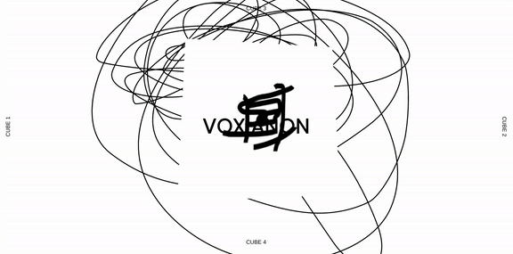
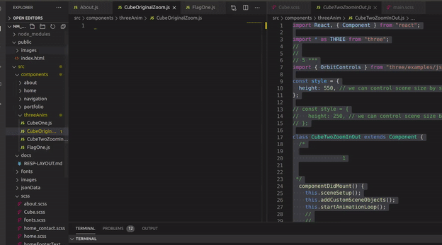
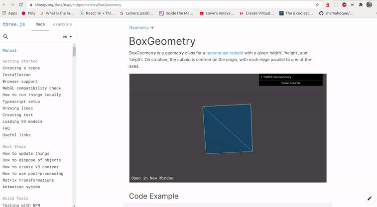
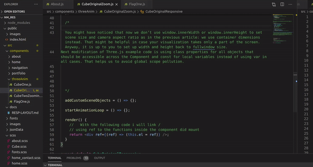
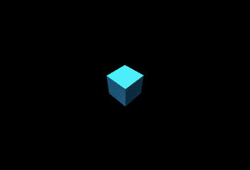
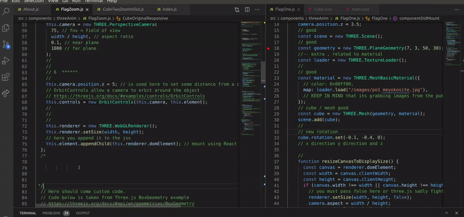
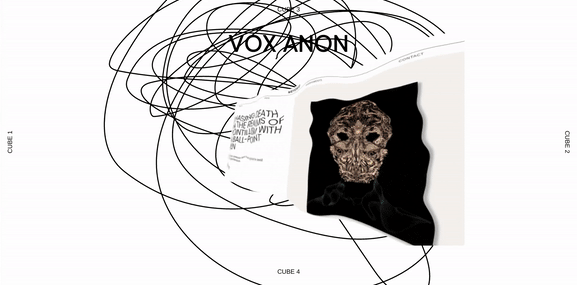

## 🏜️

# BASIC CUBE and FLAG (responsive)

- tutorial result

[]()

  <br>

👾 👾 👾

- The author of this tutorial is
  [Alexander Solovyev](https://github.com/supromikali)

<br>

- After the tutorial you will find aditional information, such as: **How to add several images to a cube" or "Transforming cube to a "Flag**

  <br>
    <br>

  <br>
  <hr>
    <br>
      <br>
    <br>

## This is an example of how you should set up the functions (the clean and corrected code will be shared at the end)

## Code structure 🌵

- The goal of the first article was to start with React and Three.js with as little effort as possible; the goal, which we successfully accomplished within about 5 minutes. However, the code that was simply copy-and-pasted from Three.js tutorials is not easy to maintain, so we’ve improved the app structure by splitting the original code of _**componentDidMount()**_ into a few methods with concise names:

<br>

## BASIC set-up ☁️

[]()

<br>

```javascript
import React, { Component } from "react";
import ReactDOM from "react-dom";
import * as THREE from "three";

class App extends Component {
  componentDidMount() {
    this.sceneSetup();
    this.addCustomSceneObjects();
    this.startAnimationLoop();
  }
  // 1
  sceneSetup = () => {};
  // 2
  addCustomSceneObjects = () => {};
  // 3
  startAnimationLoop = () => {};

  render() {
    return <div ref={(ref) => (this.el = ref)} />;
  }
}

const rootElement = document.getElementById("root");
ReactDOM.render(<App />, rootElement);
```

<br>

##### At the moment we have 3 new methods:

- sceneSetup()
- addCustomSceneObjects() and
- startAnimationLoop()

##### while everything else is left untouched. Let’s move on and see what they are about.

 <br>

## Scene Setup 🌥️

- Three.js scene setup is a pretty standard task that can be seen in different examples with minor changes in config. The aim of this method is to take care of the scene, camera, and renderer creation. If you are not familiar with those terms, please check Three.js [“Creating a scene” ](https://threejs.org/docs/#manual/en/introduction/Creating-a-scene) manual.

```javascript
sceneSetup = () => {
  // get container dimensions and use them for scene sizing
  const width = this.el.clientWidth;
  const height = this.el.clientHeight;

  this.scene = new THREE.Scene();
  this.camera = new THREE.PerspectiveCamera(
    75, // fov = field of view
    width / height, // aspect ratio
    0.1, // near plane
    1000 // far plane
  );

  // set some distance from a cube that is located at z = 0
  this.camera.position.z = 5;

  this.renderer = new THREE.WebGLRenderer();
  this.renderer.setSize(width, height);
  this.el.appendChild(this.renderer.domElement); // mount using React ref
};
```

<br>

## ⚠️

- **You might have noticed that now we don’t use window.innerWidth or window.innerHeight to set scene size and camera aspect ratio as in the previous article**: we use container dimensions instead. That might be helpful in case your visualization takes only a part of the screen. Anyway, it is up to you to set up width and height back to fullwindow size.

<br>

- Next modification of Three.js example code is **using class properties for all objects that should be accessible across the Component** and **const for local variables instead of using var in all cases.** That helps us to avoid global scope pollution.

<br>
<br>
<br>

## Custom Scene Objects 🌥️

<br>

- Next method is used for adding any custom Three.js objects into a scene, so it’s a place for experiments. For example, I have taken the code below from Three.js example for BoxGeometry without any modifications except for using **const instead of var**. This way, any Three.js [example](https://threejs.org/docs/#api/en/geometries/BoxGeometry) might be easily adopted as follows:

<br>

[](https://threejs.org/docs/#api/en/geometries/BoxGeometry)

<br>

```javascript
addCustomSceneObjects = () => {
  const geometry = new THREE.BoxGeometry(2, 2, 2);
  //
  //
  //
  const material = new THREE.MeshPhongMaterial({
    color: 0x156289,
    emissive: 0x072534,
    side: THREE.DoubleSide, //will help you to see the inside of the cube
    flatShading: true,
  });
  //
  // - The only object that I didn’t make local is the **cube** because we might want to animate it later.
  this.cube = new THREE.Mesh(geometry, material);
  this.scene.add(this.cube);

  //   YOU DON'T need this if you are going to work with the flag

  const lights = [];
  lights[0] = new THREE.PointLight(0xffffff, 1, 0);
  lights[1] = new THREE.PointLight(0xffffff, 1, 0);
  lights[2] = new THREE.PointLight(0xffffff, 1, 0);

  lights[0].position.set(0, 200, 0);
  lights[1].position.set(100, 200, 100);
  lights[2].position.set(-100, -200, -100);

  this.scene.add(lights[0]);
  this.scene.add(lights[1]);
  this.scene.add(lights[2]);
};
```

<br>

- The only object that I didn’t make local is the **cube** because we might want to animate it later.

[]()

<br>
<br>
<br>

## Animation Loop 🌥️

- The last method at the current stage is for scene animation:

```javascript
startAnimationLoop = () => {
  // this.cube.rotation.x += 0.01;
  // this.cube.rotation.y += 0.01;

  this.renderer.render(this.scene, this.camera);
  this.requestID = window.requestAnimationFrame(this.startAnimationLoop);
};
```

<br>

In this method, I left comments on **cube rotation** to highlight the fact that it is just a visual effect and **can be skipped if you don’t need it**. Two next lines are essentially the animation loop. Here’s the quote from the Three.js docs:

> This will create a loop that causes the renderer to draw the scene every time the screen is refreshed (on a typical screen this means 60 times per second).

#### ☁️

- If you’re new to writing games in the browser, you might say **“why don’t we just create a setInterval ?”** The thing is — we could, but **requestAnimationFrame has a number of advantages**. Perhaps the most important one is that **it pauses when the user navigates to another browser tab, hence not wasting their precious processing power and battery life**. ~ Three.js docs

#### ☁️

<br>

> One more thing: the refresh rate of the screen should not be confused with frames per second (FPS): having FPS equal screen refresh rate is desirable; lower FPS looks like freezing; and greater FPS is a waste of resources. Many of the Three.js demos come with a handy Stats utility that displays FPS count and might be very useful for Three.js performance tuning.

<br>
<br>

## Camera Controls 🌥️

- Since we’re done with the methods and have explained all the necessary code, let’s move on and add interactivity to the app by importing and instantiating of **camera controls that would allow a user to rotate and move the camera around the object in a scene.** For camera controls, there is a Three.js utility named **OrbitControls** that works with Perspective and Orthographic camera types. The main issue with this utility was that it could only work using a global THREE object so that it wasn’t easy to import and use in React app.

<br>

- Thank to the Three.js maintainers, now we can finally use ES6 OrbitControls and import it from the three npm package in 2019 without any side packages:

<br>

```javascript
//  ADD THIS inside the SCENE SETUP
import { OrbitControls } from "three/examples/jsm/controls/OrbitControls";
//
```

<br>

- **OrbitControls** are not located in a **utility** folder but rather — under **examples**, just as a lot of other helpful stuff that Three.js maintainers don’t call utils, for example, OBJLoader which is necessary for loading of **.OBJ models** into a scene.

<br>

[](https://threejs.org/examples/#webgl_animation_keyframes)

#### **artist**: [Glen Fox](https://www.artstation.com/glenatron)

<br>

- After the import of **OrbitControls** we should instantiate it in a **sceneSetup()** method after a camera is available. For example, that might be the next line after acamera instance is created:

<br>

```javascript
this.camera = new THREE.PerspectiveCamera(
  75, // fov = field of view
  width / height, // aspect ratio
  0.1, // near plane
  1000 // far plane
);
this.controls = new OrbitControls(this.camera, this.el);
//
//                              ***
// after that this.controls might be used for enabling/disabling zoom:
//
// this.controls.enableZoom = false;
```

<br>

- **this.el** should be passed as a **second param** into an OrbitControls constructor only for event listeners bindings and is optional (in case your scene is full-screen in size, for example). However, _**if the scene is only a part of the screen, then you probably would like to disable zoom on scroll, otherwise scrolling a page would also cause zooming of the scene**._

> Now the user can interact with a scene with a mouse: rotate and move it in any direction.

- To learn more about camera controls, please, check Three.js  
  [OrbitControls manual.](https://threejs.org/docs/#examples/en/controls/OrbitControls)

<br>
<br>

## Responsiveness 🌥️

- Next thing to do is to make our app responsive because almost every app needs to be responsive nowadays, so **we should add an event listener at the end of the componentDidMount() method:**

<br>

```javascript
componentDidMount() {
    // ..
    window.addEventListener('resize', this.handleWindowResize);
}

handleWindowResize = () => {
    const width = this.el.clientWidth;
    const height = this.el.clientHeight;

//
//
// updated renderer
    this.renderer.setSize( width, height );
    //
    // updated **camera** aspect ratio
    this.camera.aspect = width / height;
    //
    //
    // That is the Three.js optimization: you can group multiple camera changes into a block with only one
    this.camera.updateProjectionMatrix();
};
```

<br>

- In the code above, we’ve updated **camera** aspect ratio and renderer size to match current container dimensions. After making changes to most of the **camera** properties you have to call **.updateProjectionMatrix()** for the changes to take effect. That is the Three.js optimization: you can group multiple camera changes into a block with only one **.updateProjectionMatrix()** call.

<br>

- Now, the scene adapts to the window size and the app can be used on mobile.

> If you have a more complicated use case of scene resizing, like scaling or preserving constant height in full-screen mode on window resize, you should check Three.js FAQ as soon as they have a special formula for field-of-view calculation with a live demo.

<br>
<br>
<br>
<br>

## Unmount 🌥️

- According to the React guide for Other Libraries integration, **we should take care of clean up in acomponentWillUnmount() lifecycle method**. Basically, **we should remove everything that was attached to the window object, such as:**
  <br>

- any custom event listeners (resize in our case),
- requestAnimationFrame()
  <br>

- any Three.js event listeners, OrbitControls utility in our case. It has some event listeners attached to the window even if this.el is passed into a camera controls constructor that might be cleared using a dispose method according to their docs.

```javascript

componentWillUnmount() {
    window.removeEventListener('resize', this.handleWindowResize);
    window.cancelAnimationFrame(this.requestID);
    this.controls.dispose();
}
```

- While removing event listener is a standard practice, **cancelAnimationFrame()method** probably needs a bit of explanation: it’s a method paired with **requestAnimationFrame()** and uses **requestID** to cancel next scheduled frame request.
  <br>

- We are done for now: we now have an interactive and responsive React app with Three.js inside that fits container size and might be unmounted without errors or memory leaks.

<br>

#### 🔺 DONT FORGET TO ADD THIS (above the class component)

<br>

```javascript
const style = {
  height: 250, // we can control scene size by setting container dimensions
};

// above
class App extends Component {}
```

<br>

#### STYLES (index.html) 🌥️

```javascript
<!DOCTYPE html>
<html lang="en">

<head>
    <meta charset="utf-8">
    <meta name="viewport" content="width=device-width, initial-scale=1, shrink-to-fit=no">
    <meta name="theme-color" content="#000000">
    <!--
      manifest.json provides metadata used when your web app is added to the
      homescreen on Android. See https://developers.google.com/web/fundamentals/engage-and-retain/web-app-manifest/
    -->
    <link rel="manifest" href="%PUBLIC_URL%/manifest.json">
    <link rel="shortcut icon" href="%PUBLIC_URL%/favicon.ico">
    <!--
      Notice the use of %PUBLIC_URL% in the tags above.
      It will be replaced with the URL of the `public` folder during the build.
      Only files inside the `public` folder can be referenced from the HTML.

      Unlike "/favicon.ico" or "favicon.ico", "%PUBLIC_URL%/favicon.ico" will
      work correctly both with client-side routing and a non-root public URL.
      Learn how to configure a non-root public URL by running `npm run build`.
    -->
    <title>React App</title>
    <style>
        body {
            margin: 0;
            overflow: hidden;
            background: rgba(0,0,0,0.9);
            display: flex;
            align-items: center;
            justify-content: center;
            color: white;
            font: 12px sans-serif;
        }
        button {
            background: gray;
            color: white;
            margin: 20px;
            border: 0;
            border-radius: 2px;
            padding: 6px 12px;
            cursor: pointer;
            transition: background 0.3s ease-in-out;
        }
        button:hover {
            background: dimgray;
        }
        :focus {
            outline: none;
        }
        div {
            width: 90%;
            margin: 0 5%;
            text-align: center;
            max-width: 800px;
            border-radius: 5px;
            overflow: hidden;
            margin-bottom: 20px;
        }
    </style>
</head>

<body>
<noscript>
    You need to enable JavaScript to run this app.
</noscript>
<div id="root"></div>
<!--
  This HTML file is a template.
  If you open it directly in the browser, you will see an empty page.

  You can add webfonts, meta tags, or analytics to this file.
  The build step will place the bundled scripts into the <body> tag.

  To begin the development, run `npm start` or `yarn start`.
  To create a production bundle, use `npm run build` or `yarn build`.
-->
</body>

</html>
```

<br>
<br>

#### THE CLEAN CODE (index.js)

```javascript
import React, { Component } from "react";
import ReactDOM from "react-dom";
import * as THREE from "three";
import { OrbitControls } from "three/examples/jsm/controls/OrbitControls";

const style = {
  height: 250, // we can control scene size by setting container dimensions
};

class App extends Component {
  componentDidMount() {
    this.sceneSetup();
    this.addCustomSceneObjects();
    this.startAnimationLoop();
    window.addEventListener("resize", this.handleWindowResize);
  }

  componentWillUnmount() {
    window.removeEventListener("resize", this.handleWindowResize);
    window.cancelAnimationFrame(this.requestID);
    this.controls.dispose();
  }

  // Standard scene setup in Three.js. Check "Creating a scene" manual for more information
  // https://threejs.org/docs/#manual/en/introduction/Creating-a-scene
  sceneSetup = () => {
    // get container dimensions and use them for scene sizing
    const width = this.el.clientWidth;
    const height = this.el.clientHeight;

    this.scene = new THREE.Scene();
    this.camera = new THREE.PerspectiveCamera(
      75, // fov = field of view
      width / height, // aspect ratio
      0.1, // near plane
      1000 // far plane
    );
    this.camera.position.z = 5; // is used here to set some distance from a cube that is located at z = 0
    // OrbitControls allow a camera to orbit around the object
    // https://threejs.org/docs/#examples/controls/OrbitControls
    this.controls = new OrbitControls(this.camera, this.el);
    this.renderer = new THREE.WebGLRenderer();
    this.renderer.setSize(width, height);
    this.el.appendChild(this.renderer.domElement); // mount using React ref
  };

  // Here should come custom code.
  // Code below is taken from Three.js BoxGeometry example
  // https://threejs.org/docs/#api/en/geometries/BoxGeometry
  addCustomSceneObjects = () => {
    const geometry = new THREE.BoxGeometry(2, 2, 2);
    const material = new THREE.MeshPhongMaterial({
      color: 0x156289,
      emissive: 0x072534,
      side: THREE.DoubleSide,
      flatShading: true,
    });
    this.cube = new THREE.Mesh(geometry, material);
    this.scene.add(this.cube);

    const lights = [];
    lights[0] = new THREE.PointLight(0xffffff, 1, 0);
    lights[1] = new THREE.PointLight(0xffffff, 1, 0);
    lights[2] = new THREE.PointLight(0xffffff, 1, 0);

    lights[0].position.set(0, 200, 0);
    lights[1].position.set(100, 200, 100);
    lights[2].position.set(-100, -200, -100);

    this.scene.add(lights[0]);
    this.scene.add(lights[1]);
    this.scene.add(lights[2]);
  };

  startAnimationLoop = () => {
    this.cube.rotation.x += 0.01;
    this.cube.rotation.y += 0.01;

    this.renderer.render(this.scene, this.camera);

    // The window.requestAnimationFrame() method tells the browser that you wish to perform
    // an animation and requests that the browser call a specified function
    // to update an animation before the next repaint
    this.requestID = window.requestAnimationFrame(this.startAnimationLoop);
  };

  handleWindowResize = () => {
    const width = this.el.clientWidth;
    const height = this.el.clientHeight;

    this.renderer.setSize(width, height);
    this.camera.aspect = width / height;

    // Note that after making changes to most of camera properties you have to call
    // .updateProjectionMatrix for the changes to take effect.
    this.camera.updateProjectionMatrix();
  };

  render() {
    return <div style={style} ref={(ref) => (this.el = ref)} />;
  }
}

class Container extends React.Component {
  state = { isMounted: true };

  render() {
    const { isMounted = true } = this.state;
    return (
      <>
        <button
          onClick={() =>
            this.setState((state) => ({ isMounted: !state.isMounted }))
          }
        >
          {isMounted ? "Unmount" : "Mount"}
        </button>
        {isMounted && <App />}
        {isMounted && <div>Scroll to zoom, drag to rotate</div>}
      </>
    );
  }
}

const rootElement = document.getElementById("root");
ReactDOM.render(<Container />, rootElement);
```

<br>
<br>

#### RESULT 🌵

- CLICK ON THE IMAGE TO SEE THE ORIGINAL ARTICLE

[](https://codeburst.io/react-16-three-js-integration-tips-2019-b6afe19c0b83)

<br>
<br>
<hr>
<br>
<br>

## 🏜️

### PERSONAL MODIFICATIONS TO THE PROJECT

- ADDING SEVERAL IMAGES TO THE CUBE
- I added a loader which (check the dependencies)

<br>

##### the code before

```javascript
const material = new THREE.MeshPhongMaterial({
  color: 0x156289,
  emissive: 0x072534,
  side: THREE.DoubleSide,
  flatShading: true,

  // KEEP IN MIND that its grabbing images from the public/images folder not the src
});
```

<br>

##### I find this article helpful (to add several images)

[Three Js How To Map A Different Random Image On All Sides Of A Cube In A Group Of Cubes](https://stackoverflow.com/questions/14125951/three-js-how-to-map-a-different-random-image-on-all-sides-of-a-cube-in-a-group-o)

<br>

```javascript
addCustomSceneObjects = () => {
  const geometry = new THREE.BoxGeometry(2, 2, 2);

  const loader = new THREE.TextureLoader();
  // const material = new THREE.MeshPhongMaterial({
  //   //   color: 0x156289,
  //   emissive: 0x072534,
  //   side: THREE.DoubleSide,
  //   flatShading: true,
  //   // color: 0x00ff00,

  //   // KEEP IN MIND that its grabbing images from the public/images folder not the src
  // });

  //
  const material = new THREE.MeshFaceMaterial([
    new THREE.MeshBasicMaterial({
      map: THREE.ImageUtils.loadTexture("/images/fluxusshop_2.gif"),
      emissive: 0x072534,
      side: THREE.DoubleSide,
      flatShading: true,
    }),
    new THREE.MeshBasicMaterial({
      map: THREE.ImageUtils.loadTexture("/images/po1_meyokosite.jpg"),
      emissive: 0x072534,
      side: THREE.DoubleSide,
      flatShading: true,
    }),
    new THREE.MeshBasicMaterial({
      map: THREE.ImageUtils.loadTexture("/images/fluxusshop_2.gif"),
      emissive: 0x072534,
      side: THREE.DoubleSide,
      flatShading: true,
    }),
    new THREE.MeshBasicMaterial({
      map: THREE.ImageUtils.loadTexture("/images/po1_meyokosite.jpg"),
      emissive: 0x072534,
      side: THREE.DoubleSide,
      flatShading: true,
    }),
    new THREE.MeshBasicMaterial({
      map: THREE.ImageUtils.loadTexture("/images/fluxusshop_2.gif"),
      emissive: 0x072534,
      side: THREE.DoubleSide,
      flatShading: true,
    }),
    new THREE.MeshBasicMaterial({
      map: THREE.ImageUtils.loadTexture("/images/po1_meyokosite.jpg"),
      emissive: 0x072534,
      side: THREE.DoubleSide,
      flatShading: true,
    }),
  ]);
  // ... the rest of the code, light etc
  //                    ...
};
```

[]()

<br>
<br>
<br>
<br>

# 🌵

#### IN THE NEXT STEP , i used ".this" to convert most of the old flag data to the new responsive cube/flag

[](https://youtu.be/p1LAo6H_Nb4)

<br>
<br>

#### THE FLAG

```javascript
import React, { Component } from "react";
import * as THREE from "three";
import { OrbitControls } from "three/examples/jsm/controls/OrbitControls";

const style = {
  height: 550, // we can control scene size by setting container dimensions
};

class FlagZoom extends Component {
  /*
 
                1
 
 
 */
  componentDidMount() {
    this.sceneSetup();
    this.addCustomSceneObjects();
    this.startAnimationLoop();
    //
    //
    //
    // 7  ******
    //
    window.addEventListener("resize", this.handleWindowResize);
  }
  /*
 
                9
 
 
 */
  componentWillUnmount() {
    window.removeEventListener("resize", this.handleWindowResize);
    window.cancelAnimationFrame(this.requestID);
    this.controls.dispose();
  }
  /*
 
                2
 
 
 */
  // Standard scene setup in Three.js. Check "Creating a scene" manual for more information
  // https://threejs.org/docs/#manual/en/introduction/Creating-a-scene
  sceneSetup = () => {
    // get container dimensions and use them for scene sizing
    const width = this.element.clientWidth;
    const height = this.element.clientHeight;
    //
    //
    //
    //
    this.scene = new THREE.Scene();
    this.camera = new THREE.PerspectiveCamera(
      85, // fov = field of view
      width / height, // aspect ratio
      0.2, // near plane
      1000 // far plane
    );
    //
    //
    // 6  ******
    //
    this.camera.position.z = 4; // is used here to set some distance from a cube that is located at z = 0
    // OrbitControls allow a camera to orbit around the object
    // https://threejs.org/docs/#examples/controls/OrbitControls
    this.controls = new OrbitControls(this.camera, this.element);
    //
    //
    //
    this.renderer = new THREE.WebGLRenderer({
      // set the transparency of the scene, otherwise its black
      alpha: true,
      // will make the edges smooth
      antialias: true,
    });
    this.renderer.setSize(width, height);
    // here you append it to the jsx
    this.element.appendChild(this.renderer.domElement); // mount using React ref
  };
  /*
 
                3
 
 
 */
  // Here should come custom code.
  // Code below is taken from Three.js BoxGeometry example
  // https://threejs.org/docs/#api/en/geometries/BoxGeometry
  addCustomSceneObjects = () => {
    const geometry = new THREE.PlaneGeometry(8, 4, 50, 20);
    //-- extra , related to material
    const loader = new THREE.TextureLoader();
    // const material = new THREE.MeshPhongMaterial({
    //   //   color: 0x156289,
    //   emissive: 0x072534,
    //   side: THREE.DoubleSide,
    //   flatShading: true,
    //   // color: 0x00ff00,

    //   // KEEP IN MIND that its grabbing images from the public/images folder not the src
    // });

    //
    const material = new THREE.MeshBasicMaterial({
      emissive: 0x072534,
      side: THREE.DoubleSide,
      flatShading: true,

      //   color: 0x00ff00,
      map: loader.load("/images/po1_meyokosite.jpg"),
      // KEEP IN MIND that its grabbing images from the public/images folder not the src

      //  antialias, this will smooth the edges of the cube
    });
    //
    // LIGHTS WE REALLY DONT NEED IN THE FLAG
    this.cube = new THREE.Mesh(geometry, material);
    this.scene.add(this.cube);

    const lights = [];
    lights[0] = new THREE.PointLight(0xffffff, 1, 0);
    lights[1] = new THREE.PointLight(0xffffff, 1, 0);
    lights[2] = new THREE.PointLight(0xffffff, 1, 0);

    lights[0].position.set(0, 200, 50);
    lights[1].position.set(100, 200, 100);
    lights[2].position.set(-100, -200, -100);

    this.scene.add(lights[0]);
    this.scene.add(lights[1]);
    this.scene.add(lights[2]);

    // so that i can use it everywhere than just this scope
    this.clock = new THREE.Clock();
    this.cube.rotation.set(-0.2, -0.6, -0.1);
  };

  /*
 
                4
 
 
 */
  //  Animation Loop
  startAnimationLoop = () => {
    // in the old flag  :   const t_timeClock = this.clock.getElapsedTime();
    // in this version i only have to use "this.t_timeClock"
    this.t_timeClock = this.clock.getElapsedTime();
    //
    //
    //
    //--------------------------------
    //      The waves
    // -------------------------------
    //
    this.cube.geometry.vertices.forEach((dots_vertices) => {
      // this.cube.rotation.x += 0.01; // for the cube
      // this.cube.rotation.y += 0.01; /// for the cube
      //
      // 1 WAVE  ***
      //
      //
      // // With the vertices we are going to grab all the points /vertices withing the cube/flag
      // We are going to move them in a sine "curve"
      // the map is going to make something for every single point, so each point is going to do a partcular thing, moving up down etc
      const waveX1 = 0.1 * Math.sin(dots_vertices.x * 2 + this.t_timeClock);
      // 2.5 will make the wave huge and very close to the user, 0.5 is flat , 0.1 even more flattened
      //
      //
      // 2 WAVE  ***
      //
      const waveX2 =
        0.15 * Math.sin(dots_vertices.x * 3 + this.t_timeClock * 2);
      // 0.15 is less than 0.25 , 0.25 corresponds to half of the first wave, so this 2nd wave is a "little one"
      // const waveX2 = 0.5 * Math.sin(dots_vertices.x * 3 + t_timeClock * 2);
      // the * 3 ,  multiplies the waves, so this wave runs on 3 in amplitude and moves twice as quick * 3 + t_timeClock * 2
      //
      //
      //
      // 3   *** third  wave | in the Y direction (i hid this one)
      // const waveY1 = 0.1 * Math.sin(dots_vertices.y * 6 + t_timeClock * 0.1); //to slowdown the time t_timeClock * 0.5);
      //
      //
      dots_vertices.z = waveX1 + waveX2;
    });
    //
    //
    //
    //
    //
    this.cube.geometry.verticesNeedUpdate = true;
    //https://threejs.org/docs/#manual/en/introduction/How-to-update-things
    //
    //
    this.renderer.render(this.scene, this.camera);

    // The window.requestAnimationFrame() method tells the browser that you wish to perform
    // an animation and requests that the browser call a specified function
    // to update an animation before the next repaint
    this.requestID = window.requestAnimationFrame(this.startAnimationLoop);

    /*
    window.requestAnimationFrame(this.startAnimationLoop);
    
    This will create a loop that causes the renderer to draw the scene every time the screen is refreshed (on a typical screen this means 60 times per second). If you’re new to writing games in the browser, you might say “why don’t we just create a setInterval ?” The thing is — we could, but requestAnimationFrame has a number of advantages. Perhaps the most important one is that it pauses when the user navigates to another browser tab, hence not wasting their precious processing power and battery life. ~ Three.js docs
    

    https://codeburst.io/react-16-three-js-integration-tips-2019-b6afe19c0b83
    */
  };
  /*
 
                8
 
 
 */
  handleWindowResize = () => {
    const width = this.element.clientWidth;
    const height = this.element.clientHeight;

    this.renderer.setSize(width, height);
    this.camera.aspect = width / height;

    // Note that after making changes to most of camera properties you have to call
    // .updateProjectionMatrix for the changes to take effect.
    this.camera.updateProjectionMatrix();
  };

  render() {
    return (
      <div
        className="flagZoomBox"
        style={style}
        ref={(ref) => (this.element = ref)}
      />
    );
  }
}

export default FlagZoom;
```

[]();

#### the scss

```scss
/*------ABOUT-SEE MORE---------- */
.header-container {
  width: 100vw;
  height: 100vh;

  display: flex;
  justify-content: center;
  align-items: center;
  flex-direction: column;
  //

  //
  //
  background-image: url(../images/garabato_onblanc1.svg);
  background-repeat: no-repeat;
  background-size: cover;
  background-position: center;

  nav {
    list-style-type: none;
    .linnko {
      color: #000;
      text-decoration: none;
      padding-bottom: 3px;
      border-bottom: 4px solid transparent;
      transition: border-bottom 0.5s ease-in-out;

      &:hover {
        padding-bottom: 3px;
        border-bottom-color: #333333;
      }
    }
    .cube1 {
      position: fixed;
      top: 50%;
      left: 20px;
      transform-origin: 0 0;
      transform: rotate(-90deg) translate(-50%, 0);
    }

    .cube2 {
      position: fixed;
      top: 50%;
      right: 20px;

      transform-origin: 100% 0;
      transform: rotate(90deg) translate(50%, 0);
    }

    .cube3 {
      position: fixed;

      top: 20px;
      left: 50%;
      transform: translate(-50%, 0);
    }
    .cube4 {
      position: fixed;
      bottom: 20px;
      left: 50%;
      transform: translate(-50%, 10%);
    }
  }

  /* ------ */
  .texto-dos {
    position: absolute;
    top: 50%;
    left: 50%;
    transform: translate(-50%, -50%);
    // -webkit-text-stroke: 1px rgb(255, 255, 255);
    // -webkit-text-fill-color: transparent;
    text-align: center;
    line-height: 59px;
    font-size: 3.6rem;
    letter-spacing: 2px;

    font-family: "Poppins-light";
  }

  /* img */
  img.navi-image {
    position: absolute;
    top: 50%;
    left: 50%;
    width: 200px;
    transform: translate(-50%, -50%);
    border: 5px solid #000;
  }
  //
  //
  // -------------------
  // SCENE THREE JS area
  // -------------------
  //
  .flagZoomBox {
    width: 90%;
    margin: 0 5%;
    background: transparent;
    text-align: center;
    max-width: 900px;
    border-radius: 5px;
    overflow: hidden;
    margin-bottom: 20px;
  }

  .button-cube-original-zoom {
    background-color: yellow;

    p {
      color: red;
    }
    button.btn-zoom-original {
      background: gray;
      color: white;
      margin: 20px;
      border: 0;
      border-radius: 2px;
      padding: 6px 12px;
      cursor: pointer;
      transition: background 0.3s ease-in-out;
    }
    button:hover {
      background: dimgray;
    }
    :focus {
      outline: none;
    }
  }
}
```
