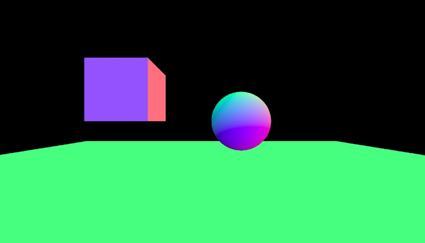

## Various Geometries (Lights)

#### Find the first project related to this:

[VARIOUS GEOMETRIES "scene"](https://github.com/nadiamariduena/three-js/tree/master/various-geometries-scene)

<br>

[]()

<br>
<br>
<hr>
<br>
<br>
<br>

## SpotLight

- **SpotLight** is a conical light source (spotlight light source), **similar to a light source such as a flashlight or street lamp. SpotLight has a direction and can produce shadows**. Now we add shadows to the above scene. To make the scene have the following 4 steps:

1. Add a light source and set to spread the shadow:

##### Replace the original code

```javascript
// REPLACE THIS
//
//
var spotLight = new THREE.SpotLight(0xff0000);
spotLight.position.set(0, 10, 0);
spotLight.castShadow = true;
scene.add(spotLight);
//
// FOR THIS
//
//
this.scene.add(this.plane);

//                  **    LIGHTS   ***
//
this.spotLight = new THREE.SpotLight(0xffffff);
this.spotLight.position.set(0, 10, 0);
this.spotLight.castShadow = true;
this.scene.add(this.spotLight);
```

[]()
