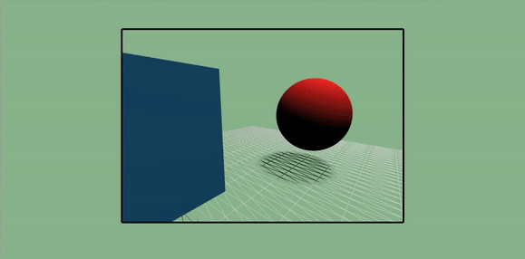
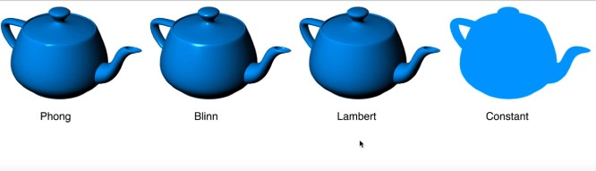
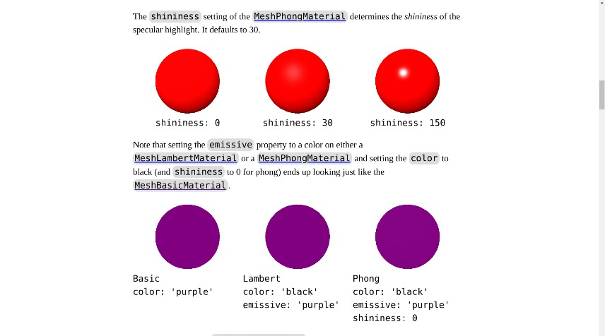
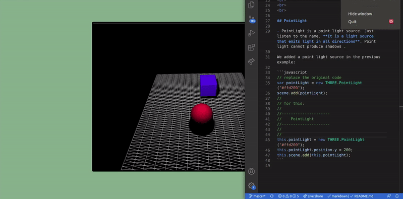
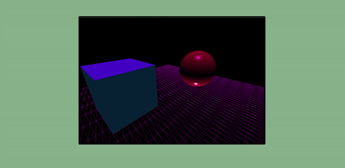
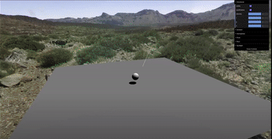
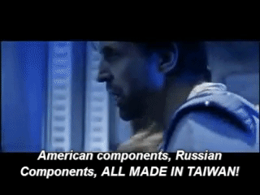
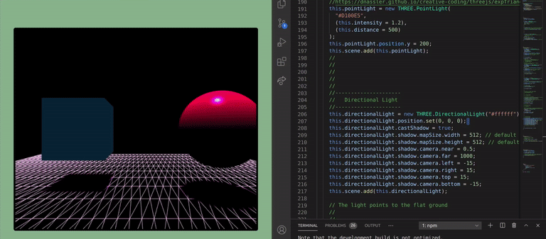
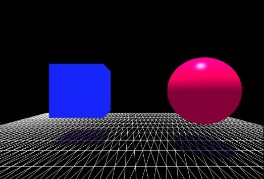

## Various Geometries (Lights 1 part)

#### Find the first project related to this:

[Various Geometries (Lights 0 part)](https://github.com/nadiamariduena/three-js/tree/master/various-geomatries-lights)

<br>

[]()
<br>
<br>

👾
👾 👾

- The author of this tutorial is
  [Three.js tutorial (5): light source](https://www.kai666666.top/2020/01/30/Three.js%E6%95%99%E7%A8%8B%EF%BC%885%EF%BC%89%EF%BC%9A%E5%85%89%E6%BA%90/)

👾 👾 👾

<br>
<hr>
<br>
<br>
<br>

### BEFORE STARTING ⚠️

<br>

- **DONT FORGET** to add the right material, as few of the basic dont work with lights

> **The MeshBasicMaterial** is not affected by lights. **The MeshLambertMaterial** computes lighting only at the vertices vs **the MeshPhongMaterial** which computes lighting at every pixel. **The MeshPhongMaterial** also supports specular highlights.

<br>

[](https://youtu.be/4njnviuvt1Q)

```javascript
// 1
const cubeMaterial = new THREE.MeshLambertMaterial({
  color: 0x1900e5,
});
// 2
const sphereMaterial = new THREE.MeshLambertMaterial({ color: 0xe50042 });
```

<br>

#### MATERIALS AND LIGHTS 🍦

- **Why have all 3 when MeshPhongMaterial can do the same things as MeshBasicMaterial and MeshLambertMaterial?** The reason is the more sophisticated material takes more **GPU power** to draw. On a slower GPU like say a **mobile phone you might want to reduce the GPU power needed to draw your scene by using one of the less complex materials**. It also follows that if you don't need the extra features then use the simplest material. If you don't need the lighting and the specular highlight then use the MeshBasicMaterial.

<br>

- _**CLICK ON THE IMG**_ to read more:

[](https://threejsfundamentals.org/threejs/lessons/threejs-materials.html)

<br>
<br>
<br>
<hr>
<br>
<br>
<br>

## ☁️ PointLight ☁️

- PointLight is a point light source. Just listen to the name. **It is a light source that emits light in all directions**. Point light cannot produce shadows .

We added a point light source in the previous example:

```javascript
// replace the original code
var pointLight = new THREE.PointLight("#ffd200");
scene.add(pointLight);
//
// for this:
//
//---------------------*
//    PointLight
//---------------------*
//
//
this.pointLight = new THREE.PointLight("#ffd200");
this.pointLight.position.y = 200;
this.scene.add(this.pointLight);
```

[](https://dnassler.wordpress.com/2016/03/22/threejs-with-pointlight-shadows-and-star-sphere/)

#### The tutorial I am following is really basic in lights, so i had to do a short research

- I found out you can add different lights (like you do in 3ds max for example) for different angles, also you can handle the intensity and the distance. Unfortunately i didn't find something concrete about the topic.

```javascript
    //
    //
    //
    this.light = new THREE.PointLight(0xff0000);
    this.light.position.y = 4.5;
    this.scene.add(this.light);
    //
    //
    //
    //
    //
    // THIS LIGHT IS ON THE BOTTOM
    //---------------------
    //     spotLight FF5733
    //---------------------
    //
    // With the light you can see the colors you added to each geometry in the materials
    this.spotLight = new THREE.SpotLight(0xffffff);
    // spotLight.position.set( 0 , 10 , 0 );  original
    this.spotLight.position.set(5, -50, 0); //x, y , z
    // (2, 32, 32); with this settings the light will be on the front
    this.spotLight.castShadow = true;
    this.scene.add(this.spotLight);
    //
    //
    //
    // THIS LIGHT IS ON TOP
    //---------------------
    //    PointLight
    //---------------------

    this.pointLight = new THREE.PointLight(
      "#D100E5",
      (this.intensity = 1.2),
      (this.distance = 500)
    );
    this.pointLight.position.y = 200;
    this.scene.add(this.pointLight);
  };
```

<!--  -->

[](https://threejsfundamentals.org/threejs/lessons/threejs-materials.html)

- I applied MeshPhongMaterial and Shininess to the sphere

<br>
<br>

##### I am going to do some changes, so i will keep this version of the code before i do something 🍦

```javascript
import React, { Component } from "react";
import * as THREE from "three";
import { OrbitControls } from "three/examples/jsm/controls/OrbitControls";

//
//
const style = {
  height: 550, // we can control scene size by setting container dimensions
};

//
class ObjsScene extends Component {
  componentDidMount() {
    this.sceneSetup();
    this.addCustomSceneObjects();
    this.startAnimationLoop();

    window.addEventListener("resize", this.handleWindowResize);
  }
  componentWillUnmount() {
    window.removeEventListener("resize", this.handleWindowResize);
    window.cancelAnimationFrame(this.requestID);
    this.controls.dispose();
  }
  /*
  
  
  
  */
  // 1
  sceneSetup = () => {
    const width = this.elo.clientWidth;
    const height = this.elo.clientHeight;
    //
    //
    this.scene = new THREE.Scene();
    this.camera = new THREE.PerspectiveCamera(
      65, // fov = field of view
      width / height, // aspect ratio
      0.1, // near plane
      1000 // far plane
    );
    //
    //
    //
    //
    this.camera.position.z = 5; // is used here to set some distance from a cube that is located at z = 0
    // OrbitControls allow a camera to orbit around the object
    // https://threejs.org/docs/#examples/controls/OrbitControls
    this.controls = new OrbitControls(this.camera, this.elo);

    //
    //
    //
    //
    //

    this.renderer = new THREE.WebGLRenderer({
      // set the transparency of the scene, otherwise its black
      // alpha: true,
      // will make the edges smooth
      antialias: true,
    });
    this.renderer.setSize(width, height);
    // here you append it to the jsx
    this.renderer.shadowMap.enabled = true;
    this.elo.appendChild(this.renderer.domElement); // mount using React ref
  };
  /*
  
  

  
  */
  // 2
  addCustomSceneObjects = () => {
    // Add CUBE
    const cubeGeometry = new THREE.BoxGeometry(2, 2, 2);
    const cubeMaterial = new THREE.MeshStandardMaterial({
      color: 0x1900e5,
      emissive: 0x072534,
      side: THREE.DoubleSide,
      flatShading: true,
    });
    this.cube = new THREE.Mesh(cubeGeometry, cubeMaterial);
    this.cube.position.x = -2; //left - right - horizontal
    this.cube.position.y = 0; //top - bottom - vertical
    this.cube.position.z = -1; // diagonal
    //
    //
    //
    this.cube.castShadow = true;
    //
    this.scene.add(this.cube);

    // this.cube = new THREE.Mesh(geometry, material);
    // this.scene.add(this.cube);
    // Add SPHERE
    const sphereGeometry = new THREE.SphereGeometry(1.2, 42, 42);
    const sphereMaterial = new THREE.MeshPhongMaterial({
      color: 0xe50042,
      shininess: 150,
    });
    this.sphere = new THREE.Mesh(sphereGeometry, sphereMaterial);
    //  ball position
    this.sphere.position.x = 2.6; //left - right - horizontal
    this.sphere.position.y = 0; //top - bottom - vertical
    this.sphere.position.z = 0; // diagonal
    //
    //
    this.sphere.castShadow = true;
    //
    // with this you add the cube to the scene
    this.scene.add(this.sphere);
    //
    //
    //
    //
    //
    //
    // Add PLANE  w , h , segments
    const planeGeometry = new THREE.PlaneGeometry(15, 15, 55, 15);
    const planeMaterial = new THREE.MeshLambertMaterial({
      color: 0xdddddd,
      wireframe: true,
    });
    // var planeMaterial = new THREE.MeshLambertMaterial((color: 0xff0000));
    this.plane = new THREE.Mesh(planeGeometry, planeMaterial);
    //
    this.plane.rotation.x = -0.5 * Math.PI;
    this.plane.position.y = -2;
    //
    //
    // *** RECEIVE SHADOW
    // related to the light and the shadow
    this.plane.receiveShadow = true;
    //
    //
    this.scene.add(this.plane);

    //
    //
    //
    //
    //---------------------
    //     spotLight FF5733
    //---------------------
    //
    // // THIS LIGHT IS ON THE BOTTOM
    // With the light you can see the colors you added to each geometry in the materials
    this.spotLight = new THREE.SpotLight(0xffffff);
    // spotLight.position.set( 0 , 10 , 0 );  original
    this.spotLight.position.set(5, -50, 0); //x, y , z
    // (2, 32, 32); with this settings the light will be on the front
    this.spotLight.castShadow = true;
    this.scene.add(this.spotLight);
    //
    //
    //
    //---------------------
    //    PointLight
    //---------------------
    // THIS LIGHT IS ON TOP
    //with the following link, you can have a little ideo of the intensity
    //https://dnassler.github.io/creative-coding/threejs/expTriangles1/build/
    this.pointLight = new THREE.PointLight(
      "#D100E5",
      (this.intensity = 1.2),
      (this.distance = 500)
    );
    this.pointLight.position.y = 200;
    this.scene.add(this.pointLight);
    //
    //
    //
    //
    //
    //
  };
  /*
  
  
  
  
  */
  // 3
  startAnimationLoop = () => {
    // HIDE 2
    // this.cube.rotation.x += 0.01;
    // this.cube.rotation.y += 0.01;
    // DONT HIDE
    this.renderer.render(this.scene, this.camera);
    //
    // HIDE 3 this is what makes the cube rotate
    this.requestID = window.requestAnimationFrame(this.startAnimationLoop);
  };
  //
  //
  /*
  
  
  

  */
  handleWindowResize = () => {
    const width = this.elo.clientWidth;
    const height = this.elo.clientHeight;

    this.renderer.setSize(width, height);
    this.camera.aspect = width / height;

    // Note that after making changes to most of camera properties you have to call
    // .updateProjectionMatrix for the changes to take effect.
    this.camera.updateProjectionMatrix();
  };
  //
  //

  render() {
    return (
      <div className="cubeLight-wrapper">
        <div
          className="CubeLight"
          style={style}
          ref={(ref) => (this.elo = ref)}
        ></div>
      </div>
    );
  }
}
```

<br>
<br>
<br>

#### 🌵 MORE ABOUT LIGHTS 🌵

- **Great explanation!**

[Three.js Lighting Tutorial (JavaScript) | Light Types Explained!](https://www.youtube.com/watch?v=T6PhV4Hz0u4)

[](https://www.youtube.com/watch?v=T6PhV4Hz0u4)

<br>
<br>
<br>
<br>
<br>
<br>

## ☁️ Directional Light ☁️

- _**BEFORE STARTING**_ add the following
  <br>

- this will remove the shadows

>     this.spotLight.visible = false;

##### HERE

```javascript
// THIS LIGHT IS ON THE BOTTOM
//---------------------
//     spotLight FF5733
//---------------------
//
//
//
this.spotLight = new THREE.SpotLight(0xffffff);
// spotLight.position.set( 0 , 10 , 0 );  original
this.spotLight.position.set(5, -50, 0); //x, y , z
// (2, 32, 32); with this settings the light will be on the front
this.spotLight.castShadow = true;
//
// this will remove the shadows   ****  HERE  ****
this.spotLight.visible = false;
//
this.scene.add(this.spotLight);
//
//
// THIS LIGHT IS ON TOP
//---------------------
//    PointLight
//---------------------
```

<br>

- **DirectionalLight**, as its name implies, **is a parallel linear light source** (parallel light source). _The rays of the parallel light source are parallel and can produce shadows_, and all the lights have the same intensity. **It has** an **target** attribute **to indicate which position to irradiate**.

<br>

- In addition, you can use **directionalLight.shadow.camera.left** or **directionalLight.shadow.camera.right** to set the left margin of the shadow.

```javascript
directionalLight.shadow.camera.left = -15;
directionalLight.shadow.camera.right = 15;
```

- Similarly, you can also set the right, top, and bottom equal margins, so that you can determine the range of a shadow (the larger the shadow, the better the performance The worse, so parallel light needs to set the shadow range).

<br>

##### We replace the spot light source in the first example with a parallel light source, as follows:

```javascript
// REPLACE THIS ***
// Add a light source
var directionalLight = new THREE.DirectionalLight( '#ffffff' );
directionalLight.position.set( 0 , obj.y, 0 );
directionalLight.castShadow = true ;
directionalLight.shadow.mapSize.width = 512 ;   / / default
 directionalLight.shadow.mapSize.height = 512 ; // default
 directionalLight.shadow.camera.near = 0.5 ;
directionalLight.shadow.camera.far = 1000 ;
directionalLight.shadow.camera.left = -15 ;
directionalLight.shadow. camera.right =15 ;
directionalLight.shadow.camera.top = 15 ;
directionalLight.shadow.camera.bottom = -15 ;
scene.add(directionalLight);

// The light points to the flat ground
 directionalLight.target = plane;
//
//
// FOR THIS
    //
    //
    //---------------------
    //   Directional Light
    //---------------------
    this.directionalLight = new THREE.DirectionalLight("#ffffff");
    this.directionalLight.position.set( 0 , obj.y, 0 );  // issue !!!!!!
    this.directionalLight.castShadow = true;
    this.directionalLight.shadow.mapSize.width = 512; // default
    this.directionalLight.shadow.mapSize.height = 512; // default
    this.directionalLight.shadow.camera.near = 0.5;
    this.directionalLight.shadow.camera.far = 1000;
    this.directionalLight.shadow.camera.left = -15;
    this.directionalLight.shadow.camera.right = 15;
    this.directionalLight.shadow.camera.top = 15;
    this.directionalLight.shadow.camera.bottom = -15;
    this.scene.add(this.directionalLight);

    // The light points to the flat ground
    //
    //
    //
    this.directionalLight.target = this.plane;

```

<br>

## THERE IS AN ERROR 🔺

- When adding this line:

```javascript
directionalLight.position.set(0, obj.y, 0);
```

- I thought it was due to the original code (since its translated to english and sometimes it makes some mistakes) but it wasn't that, so maybe he forgot to add a variable in the tutorial?

<br>

- Since the error came from a coordinate, i presumed that if i added something like a 0, it would probably work and **it did**

```javascript
this.directionalLight.position.set(0, 0, 0);
```

> No idea if its the right thing to do here, but **the code works as expected**, maybe in the future when i will have more knowledge i will add a note on this issue.

<br>

[](https://www.youtube.com/watch?v=dEkOT3IngMQ);

#### THE CODE

```javascript
class ObjsScene extends Component {
  componentDidMount() {
    this.sceneSetup();
    this.addCustomSceneObjects();
    this.startAnimationLoop();

    window.addEventListener("resize", this.handleWindowResize);
  }
  componentWillUnmount() {
    window.removeEventListener("resize", this.handleWindowResize);
    window.cancelAnimationFrame(this.requestID);
    this.controls.dispose();
  }
  /*


  */
  // 1
  sceneSetup = () => {
    const width = this.elo.clientWidth;
    const height = this.elo.clientHeight;
    //
    //
    this.scene = new THREE.Scene();
    this.camera = new THREE.PerspectiveCamera(
      65, // fov = field of view
      width / height, // aspect ratio
      0.1, // near plane
      1000 // far plane
    );
    //
    //
    //
    //
    this.camera.position.z = 5; // is used here to set some distance from a cube that is located at z = 0
    // OrbitControls allow a camera to orbit around the object
    // https://threejs.org/docs/#examples/controls/OrbitControls
    this.controls = new OrbitControls(this.camera, this.elo);

    //
    //
    //
    //
    //

    this.renderer = new THREE.WebGLRenderer({
      // set the transparency of the scene, otherwise its black
      // alpha: true,
      // will make the edges smooth
      antialias: true,
    });
    this.renderer.setSize(width, height);
    // here you append it to the jsx
    this.renderer.shadowMap.enabled = true;
    this.elo.appendChild(this.renderer.domElement); // mount using React ref
  };
  /*


  */
  // 2
  addCustomSceneObjects = () => {
    // Add CUBE
    const cubeGeometry = new THREE.BoxGeometry(2, 2, 2);
    const cubeMaterial = new THREE.MeshStandardMaterial({
      color: 0x1900e5,
      emissive: 0x072534,
      side: THREE.DoubleSide,
      flatShading: true,
    });
    this.cube = new THREE.Mesh(cubeGeometry, cubeMaterial);
    this.cube.position.x = -2; //left - right - horizontal
    this.cube.position.y = 0; //top - bottom - vertical
    this.cube.position.z = -1; // diagonal
    //
    //
    //
    this.cube.castShadow = true;
    //
    this.scene.add(this.cube);
    // HIDE 1
    // const geometry = new THREE.BoxGeometry(2, 2, 2);
    // const material = new THREE.MeshPhongMaterial({
    //   emissive: 0x072534,
    //   side: THREE.DoubleSide,
    //   flatShading: true,
    // });
    // this.cube = new THREE.Mesh(geometry, material);
    // this.scene.add(this.cube);
    // Add SPHERE
    const sphereGeometry = new THREE.SphereGeometry(1.2, 42, 42);
    const sphereMaterial = new THREE.MeshPhongMaterial({
      color: 0xe50042,
      shininess: 150,
    });
    this.sphere = new THREE.Mesh(sphereGeometry, sphereMaterial);
    //  ball position
    this.sphere.position.x = 2.6; //left - right - horizontal
    this.sphere.position.y = 0; //top - bottom - vertical
    this.sphere.position.z = 0; // diagonal
    //
    //
    this.sphere.castShadow = true;
    //
    // with this you add the cube to the scene
    this.scene.add(this.sphere);
    //
    //
    //
    //
    //
    //
    // Add PLANE  w , h , segments
    const planeGeometry = new THREE.PlaneGeometry(15, 15, 55, 15);
    const planeMaterial = new THREE.MeshLambertMaterial({
      color: 0xdddddd,
      wireframe: true,
    });
    // var planeMaterial = new THREE.MeshLambertMaterial((color: 0xff0000));
    this.plane = new THREE.Mesh(planeGeometry, planeMaterial);
    //
    this.plane.rotation.x = -0.5 * Math.PI;
    this.plane.position.y = -2;
    //
    //
    // *** RECEIVE SHADOW
    // related to the light and the shadow
    this.plane.receiveShadow = true;
    //
    //
    this.scene.add(this.plane);

    //
    //
    // //
    // this.light = new THREE.Light(0xff0000);
    // this.light.position.y = 4.5;
    // this.scene.add(this.light);
    //
    //
    //---------------------
    //     spotLight FF5733
    //---------------------
    //
    // // THIS LIGHT IS ON THE BOTTOM
    // With the light you can see the colors you added to each geometry in the materials
    this.spotLight = new THREE.SpotLight(0xffffff);
    // spotLight.position.set( 0 , 10 , 0 );  original
    this.spotLight.position.set(5, -50, 0); //x, y , z
    // (2, 32, 32); with this settings the light will be on the front
    this.spotLight.castShadow = true;
    //
    // this will remove the shadows
    this.spotLight.visible = false;
    //
    this.scene.add(this.spotLight);
    //
    //
    // THIS LIGHT IS ON TOP
    //---------------------
    //    PointLight
    //---------------------

    //with the following link, you can have a little ideo of the intensity
    //https://dnassler.github.io/creative-coding/threejs/expTriangles1/build/
    this.pointLight = new THREE.PointLight(
      "#D100E5",
      (this.intensity = 1.2),
      (this.distance = 500)
    );
    this.pointLight.position.y = 200;
    this.scene.add(this.pointLight);
    //
    //
    //
    //
    //
    //---------------------
    //   Directional Light
    //---------------------
    this.directionalLight = new THREE.DirectionalLight("#ffffff");
    this.directionalLight.position.set(0, 0, 0);
    this.directionalLight.castShadow = true;
    this.directionalLight.shadow.mapSize.width = 512; // default
    this.directionalLight.shadow.mapSize.height = 512; // default
    this.directionalLight.shadow.camera.near = 0.5;
    this.directionalLight.shadow.camera.far = 1000;
    this.directionalLight.shadow.camera.left = -15;
    this.directionalLight.shadow.camera.right = 15;
    this.directionalLight.shadow.camera.top = 15;
    this.directionalLight.shadow.camera.bottom = -15;
    this.scene.add(this.directionalLight);

    // The light points to the flat ground
    //
    //
    //
    this.directionalLight.target = this.plane;
  };
  /*


  */
  // 3
  startAnimationLoop = () => {
    // HIDE 2
    // this.cube.rotation.x += 0.01;
    // this.cube.rotation.y += 0.01;
    // DONT HIDE
    this.renderer.render(this.scene, this.camera);
    //
    // HIDE 3 this is what makes the cube rotate
    this.requestID = window.requestAnimationFrame(this.startAnimationLoop);
  };
  //
  //

  handleWindowResize = () => {
    const width = this.elo.clientWidth;
    const height = this.elo.clientHeight;

    this.renderer.setSize(width, height);
    this.camera.aspect = width / height;

    // Note that after making changes to most of camera properties you have to call
    // .updateProjectionMatrix for the changes to take effect.
    this.camera.updateProjectionMatrix();
  };
  //
  //
  /*
  */
  render() {
```

[](https://www.youtube.com/watch?v=dEkOT3IngMQ);

<br>
<br>
<br>
<br>
<br>
<br>

## ☁️ AmbientLight ☁️

#### The role of _AmbientLight_ is to **add a global color to the scene** .

- **The light source has no direction and does not produce shadows** . If you need to add an additional uniform color to the scene, then you can consider using it AmbientLight. For example, in the previous example, adding a purple to enhance the atmosphere, then you can use the light source.

<br>

- **Add the following**
  <br>

```javascript
//
// REPLACE THIS:
//
var ambientLight = new THREE.AmbientLight("#9370DB");
scene.add(ambientLight);
//
//// FOR THIS:
//
//---------------------
//    AmbientLight
//---------------------

this.ambientLight = new THREE.AmbientLight("#9370DB");
this.scene.add(this.ambientLight);
```

<br>

- In this result you can see that the **Directional Light** do the job of the **spotLight** , thats why when i remove the spotlight there s not difference.

[]()

<br>

### the code

```javascript
class ObjsScene extends Component {
  componentDidMount() {
    this.sceneSetup();
    this.addCustomSceneObjects();
    this.startAnimationLoop();

    window.addEventListener("resize", this.handleWindowResize);
  }
  componentWillUnmount() {
    window.removeEventListener("resize", this.handleWindowResize);
    window.cancelAnimationFrame(this.requestID);
    this.controls.dispose();
  }
  /*


  */
  // 1
  sceneSetup = () => {
    const width = this.elo.clientWidth;
    const height = this.elo.clientHeight;
    //
    //
    this.scene = new THREE.Scene();
    this.camera = new THREE.PerspectiveCamera(
      65, // fov = field of view
      width / height, // aspect ratio
      0.1, // near plane
      1000 // far plane
    );
    //
    //
    //
    //
    this.camera.position.z = 5; // is used here to set some distance from a cube that is located at z = 0
    // OrbitControls allow a camera to orbit around the object
    // https://threejs.org/docs/#examples/controls/OrbitControls
    this.controls = new OrbitControls(this.camera, this.elo);

    //
    //
    //
    //
    //

    this.renderer = new THREE.WebGLRenderer({
      // set the transparency of the scene, otherwise its black
      // alpha: true,
      // will make the edges smooth
      antialias: true,
    });
    this.renderer.setSize(width, height);
    // here you append it to the jsx
    this.renderer.shadowMap.enabled = true;
    this.elo.appendChild(this.renderer.domElement); // mount using React ref
  };
  /*


  */
  // 2
  addCustomSceneObjects = () => {
    // Add CUBE
    const cubeGeometry = new THREE.BoxGeometry(2, 2, 2);
    const cubeMaterial = new THREE.MeshStandardMaterial({
      color: 0x1900e5,
      emissive: 0x072534,
      side: THREE.DoubleSide,
      flatShading: true,
    });
    this.cube = new THREE.Mesh(cubeGeometry, cubeMaterial);
    this.cube.position.x = -2; //left - right - horizontal
    this.cube.position.y = 0; //top - bottom - vertical
    this.cube.position.z = -1; // diagonal
    //
    //
    //
    this.cube.castShadow = true;
    //
    this.scene.add(this.cube);

    // Add SPHERE
    const sphereGeometry = new THREE.SphereGeometry(1.2, 42, 42);
    const sphereMaterial = new THREE.MeshPhongMaterial({
      color: 0xe50042,
      shininess: 150,
    });
    this.sphere = new THREE.Mesh(sphereGeometry, sphereMaterial);
    //  ball position
    this.sphere.position.x = 2.6; //left - right - horizontal
    this.sphere.position.y = 0; //top - bottom - vertical
    this.sphere.position.z = 0; // diagonal
    //
    //
    this.sphere.castShadow = true;
    //
    // with this you add the cube to the scene
    this.scene.add(this.sphere);
    //
    //
    //
    //
    //
    //
    // Add PLANE  w , h , segments
    const planeGeometry = new THREE.PlaneGeometry(15, 15, 55, 15);
    const planeMaterial = new THREE.MeshLambertMaterial({
      color: 0xdddddd,
      wireframe: true,
    });
    // var planeMaterial = new THREE.MeshLambertMaterial((color: 0xff0000));
    this.plane = new THREE.Mesh(planeGeometry, planeMaterial);
    //
    this.plane.rotation.x = -0.5 * Math.PI;
    this.plane.position.y = -2;
    //
    //
    // *** RECEIVE SHADOW
    // related to the light and the shadow
    this.plane.receiveShadow = true;
    //
    //
    this.scene.add(this.plane);

    //
    //
    //
    //
    //THIS LIGHT IS ON THE BOTTOM
    //---------------------
    //     spotLight FF5733
    //---------------------
    //
    //
    //
    //
    //  geometry in the materials
    this.spotLight = new THREE.SpotLight(0xffffff);
    // spotLight.position.set( 0 , 10 , 0 );  original
    this.spotLight.position.set(5, -50, 0); //x, y , z
    // (2, 32, 32); with this settings the light will be on the front
    this.spotLight.castShadow = true;
    //
    // this will remove the shadows
    this.spotLight.visible = false;
    //
    this.scene.add(this.spotLight);
    //
    //
    //
    //

    //
    // THIS LIGHT IS ON TOP
    //---------------------
    //    PointLight
    //---------------------
    //
    //
    //
    //with the following link, you can have a little idea of the intensity
    //https://dnassler.github.io/creative-coding/threejs/expTriangles1/build/
    this.pointLight = new THREE.PointLight(
      "#D100E5",
      (this.intensity = 1.2),
      (this.distance = 500)
    );
    this.pointLight.position.y = 200;
    this.scene.add(this.pointLight);
    //
    //
    //
    //
    //
    //---------------------
    //   Directional Light
    //---------------------
    //
    //
    //
    this.directionalLight = new THREE.DirectionalLight("#ffffff");
    this.directionalLight.position.set(0, 0, 0);
    this.directionalLight.castShadow = true;
    this.directionalLight.shadow.mapSize.width = 512; // default
    this.directionalLight.shadow.mapSize.height = 512; // default
    this.directionalLight.shadow.camera.near = 0.5;
    this.directionalLight.shadow.camera.far = 1000;
    this.directionalLight.shadow.camera.left = -15;
    this.directionalLight.shadow.camera.right = 15;
    this.directionalLight.shadow.camera.top = 15;
    this.directionalLight.shadow.camera.bottom = -15;
    this.scene.add(this.directionalLight);

    // The light points to the flat ground
    //
    //
    //
    this.directionalLight.target = this.plane;
    //
    //
    //
    //---------------------
    //    AmbientLight
    //---------------------

    this.ambientLight = new THREE.AmbientLight("#9370DB");
    this.scene.add(this.ambientLight);
    //
    //
    //
  };

  /*


  */
  // 3
  startAnimationLoop = () => {
    // HIDE 2
    this.cube.rotation.x += 0.01;
    this.cube.rotation.y += 0.01;
    // DONT HIDE
    this.renderer.render(this.scene, this.camera);
    //
    // HIDE 3 this is what makes the cube rotate
    this.requestID = window.requestAnimationFrame(this.startAnimationLoop);
  };
  //
  //
  /*


  */
  handleWindowResize = () => {
    // const width = this.elo.clientWidth;
    // const height = this.elo.clientHeight;

    this.renderer.setSize(width, height);
    this.camera.aspect = width / height;

    // Note that after making changes to most of camera properties you have to call
    // .updateProjectionMatrix for the changes to take effect.
    this.camera.updateProjectionMatrix();
  };
  //
  //
  /*


  */
  render() {
    return (
```

[]();

<br>
<br>
<br>
<br>
<br>
<br>

## ☁️ HemisphereLight ☁️

- The **AmbientLight** main function of the above is to **add a color to the environment**, and **there is another light source** that adds color to the environment, **HemisphereLight**. 
<br>

> HemisphereLightIt is a light source closer to nature. 

- Its **first parameter** represents the color of the sky, the **second parameter** represents the color of the ground (or environment), and the **third parameter**intensity represents the intensity. 

<br>

- We replace the previous example **AmbientLight** with as HemisphereLightfollows: